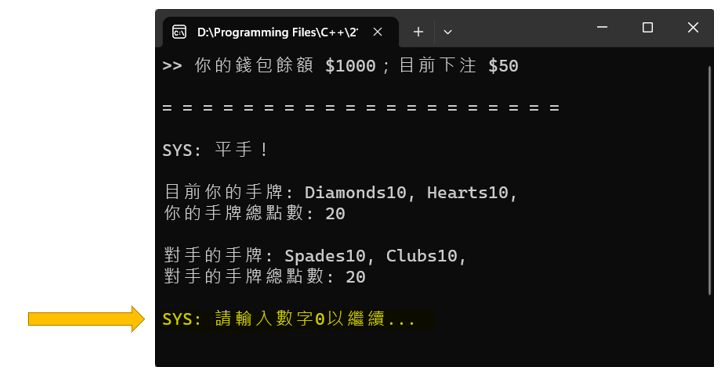
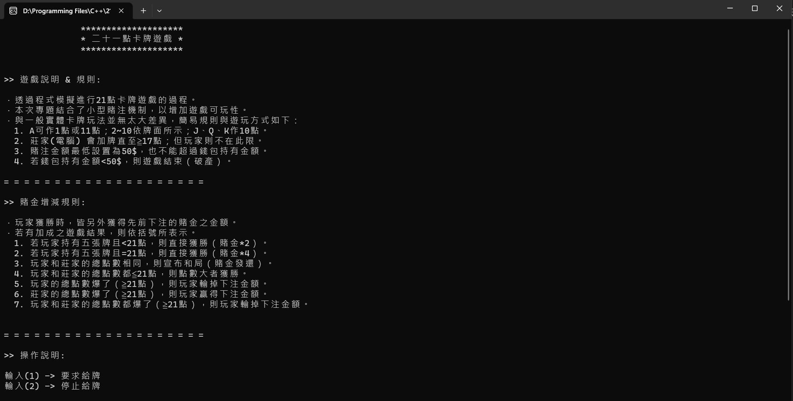
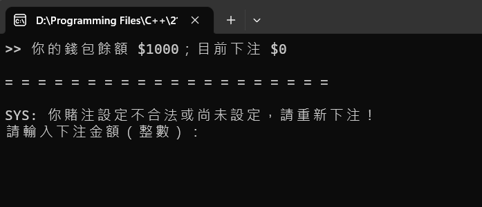
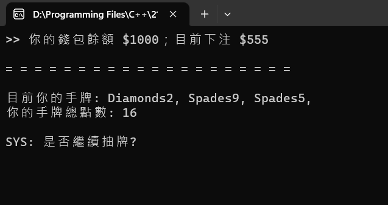
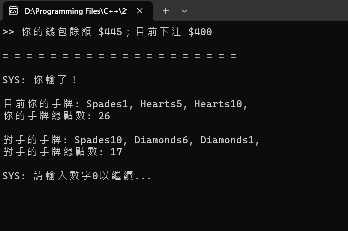
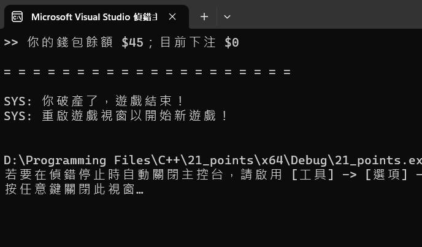

# 二十一點卡牌遊戲
## 文化大學 物件導向程式設計小專題
.
### 小組資料 & 分工
---
- **系級班級**：資訊工程學系1A
- **組別**：第6組
- **組長**：李璨宏 (程式碼構思與撰寫)
- **組員**：陳奕丞、周晉嘉  

- **本專題實作者**：李璨宏
- **賭注機制debug協作**：陳奕丞

### 遊戲介紹
---
- 透過程式模擬進行21點卡牌遊戲的過程。
- 本次專題結合了小型賭注機制，以增加遊戲可玩性。

### 遊戲規則
---
- **與一般實體卡牌玩法並無太大差異，簡述規則如下：**
    1. A 可作1點或11點；2~10 依牌面所示； J、Q、K 作10點。
    2. 莊家(電腦)會加牌直至 ≧ 17點；但玩家則不在此限。
    3. 賭注金額最低設置為 50$，也不能超過錢包持有金額。
    4. 若錢包持有金額 < 50$，則遊戲結束（破產）。  
     

- **賭金部分的增減機制如下：**
    1. 若玩家持有五張牌且 < 21，則直接獲勝（賭金*2）。
    2. 若玩家持有五張牌且 = 21，則直接獲勝（賭金*4）。
    3. 玩家和莊家的總點數相同，則宣布和局（賭金發還）。
    4. 玩家和莊家的總點數都 ≦ 21，則點數大者獲勝。
    5. 玩家的總點數爆了（≧ 21點），則玩家輸掉下注金額。
    6. 莊家的總點數爆了（≧ 21點），則玩家贏得下注金額。
    7. 玩家和莊家的總點數都爆了（≧ 21點），則玩家輸掉下注金額。

### 遊戲玩法
---
- 透過執行視窗上的操作指示，輸入其相對應動作的數值來進行。

### 遊戲執行 & 安裝方式
---
- 下載本專案之程式碼，並於任一可執行C++語言之編譯器編譯並執行即可。

### 遊戲畫面截圖
---
- **詳細遊戲介紹請參照短片：** https://youtu.be/RbtJlxay31w

** ~ ~ ~ ~ ~ ~ ~ ~ ~ ~ ~ ~ ~ ~ ~ ~ ~ ~ ~ ~ **
- **主畫面**

- **下注**

- **抽牌**

- **小局結算**

- **遊戲結束**

